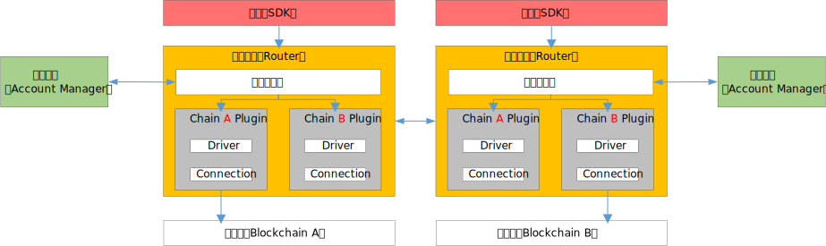
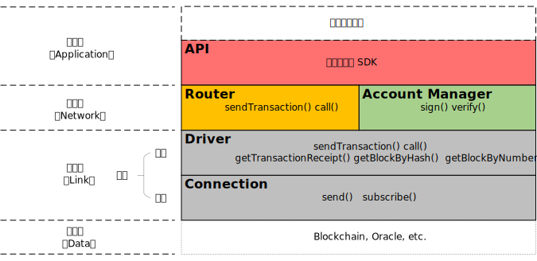

# 陆羽跨链协议

### 一、架构及组件

架构如下，各组件为：

* **应用（SDK）**：发送交易，操作跨链网络
* **账户服务（Account Manager）**：管理统一账户信息，托管二级账户私钥，用二级账户对交易进行签名
* **跨链路由（Router）**：管理插件，转发请求
  * **路由管理（Router Manager）**：路由总逻辑，调用账户服务，管理插件，调用插件 
  * **插件（Plugin）**：各种可信源插件的实现，与可信源对接

### 二、协议栈

协议分为四层

* 应用层：业务的定制逻辑、可复用的组件
* 路由层：以统一的抽象数据结构进行调用和路由
* 适配层：以插件形式适配不同区块链，将差异化的链数据抽象统一
* 数据层：可信源（区块链，预言机等）

### 三、统一抽象协议

统一抽象协议包括四个协议，在可信源、账户服务、跨链路由和应用间定义统一的抽象协议。

* **统一账户协议**：各种可信源的账户的统一抽象，实现用统一的账户操作不同可信源。
* **统一寻址协议**：各种可信源智能合约、链码等可操作对象的统一抽象，以"资源"的概念实现统一寻址。
* **统一调用协议**：各种可信源调用协议的统一抽象，实现用统一接口与参数调用资源
* **统一接入协议**：各种可信源接入协议的抽象，实现不同可信源的统一接入适配。不同可信源基于此协议开发插件，即可完成适配接入。

#### 3.1 统一账户协议

将各种可信源的账户进行统一抽象，以实现用统一的账户操作不同可信源。本协议分为一级账户与二级账户

**定义**

* 一级账户（LuyuAccount）：陆羽协议的统一账户，是对不同签名算法的链账户的统一抽象
  * 密钥管理：用户保管
  * 签名算法：ECDSA 或 国密
* 二级账户（Account）：不同签名算法的链账户，对交易进行签名，是链上的实际账户。本协议定义了一系列标准签名算法，可信源根据自身设计进行选择与实现
  * 密钥管理：托管在机构的Account Manager中
  * 签名算法
    * ECDSA
      * ECDSASecp256k1WithSHA256
      * ECDSASecp256r1WithSHA256
    * 国密
      * SM2WithSM3
    * ...（支持协议更新定义更多算法）

#### 3.2 统一寻址协议

将各种可信源的智能合约、链码等可操作对象统一抽象为”资源“，以实现统一寻址

**定义**

* 资源（Resource）：将可信源的智能合约、链码等可操作对象统一抽象为”**资源**“
* 地址（Path）：`{zone}.{chain}.{resource}`   
  * `{zone}` 业务名
  * `{chain}` 链名
  * `{resource}` 资源名
  * `{operation}` 操作
    * sendTransaction
    * call
    * getTransactionReceipt
    * getBlockByHash、getBlockByNumber
    * listResources

#### 3.3 统一调用协议

将各种可信源的调用协议进行统一抽象，以实现用统一的接口与参数对资源进行调用

**定义**

* 写入资源
  * 操作：sendTransaction
  * 参数
    * 交易（Transaction）：修改可信源数据的请求
    * 回执（Receipt）：修改可信源数据的结果
* 读取资源
  * 操作：call
  * 参数
    * 查询（CallRequest）：查询可信源数据的请求
    * 返回（CallResponse）：查询可信源数据的结果
* 查询记录
  * 操作：getTransactionReceipt
  * 参数
    * 回执（Receipt）：修改可信源数据的结果记录

* 查询区块
  * 操作：getBlockByHash、getBlockByNumber
  * 参数
    * 区块（Block）：区块结构的统一抽象
* 列举资源
  * 操作：listResources
  * 参数
    * 资源（Resource）：各种可信源的智能合约、链码等可操作的统一抽象对象

#### 3.4 统一接入协议

将各种可信源的接入协议进行抽象，以实现不同可信源的统一接入适配。不同可信源基于此协议开发插件，即可完成适配接入。本协议采用分层设计，以支持本地与远程的调用。

**定义**

* 驱动组件（Driver）
  * 功能：定义统一的可信源操作抽象接口，各可信源基于此定制化具体实现逻辑，实现统一调用协议与实际可信源调用协议的转化（如交易组装，回执处理，区块解析，资源查询等）。调用连接组件向可信源发送数据。
  * 接口
    * sendTransaction
    * call
    * getTransactionReceipt
    * getBlockByHash、getBlockByNumber
    * listResources

* 连接组件（Connection）
  * 可信源接入的抽象层，与实际可信源建立连接，将驱动组件的调用转发至可信源
  * 借助远程接入组件 “`Connection(Remote)`” 实现远程调用

### 四、调用流程

#### 4.1 单Router调用

sendTransaction操作经过层层处理，最后调用至区块链上。

流程见下图。需注意的是，区块头同步是异步的，在多个交易并发发送并被打包到一个区块中后，只需同步一次区块头即可。

#### 4.2 跨Router调用

sendTransaction操作经过层层处理，最后调用至另一个Router连接的区块链上。其中发起方Router的链路层的Connection是Remote的，该模块是Connection的抽象映射，负责转发至相应Router的Connection，接口与一般的Connection完全相同。

流程基本与单Router调用相同，区别在于多了远程的Connection模块，该模块是远端Connection的抽象映射，直接透传参数，不做任何处理。

#### 4.3 链发起调用

由区块链的SDK发起，调用至区块链A上。区块链A上部署了接收跨链调用请求的合约，合约通过事件机制回调至插件，插件将调用参数和调用者的链身份以事件的形式通知至Router Manager。Router Manager从Account Manager处查询到对应链的私钥后，调用相应的插件将跨链交易发送出去。

流程如下

