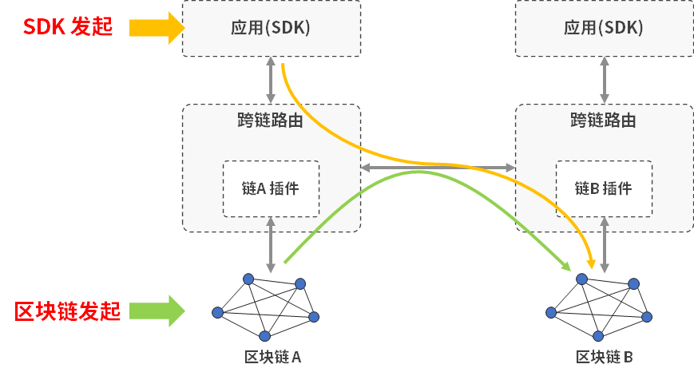
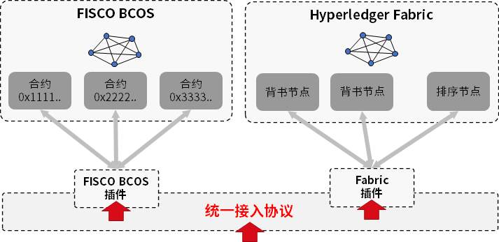
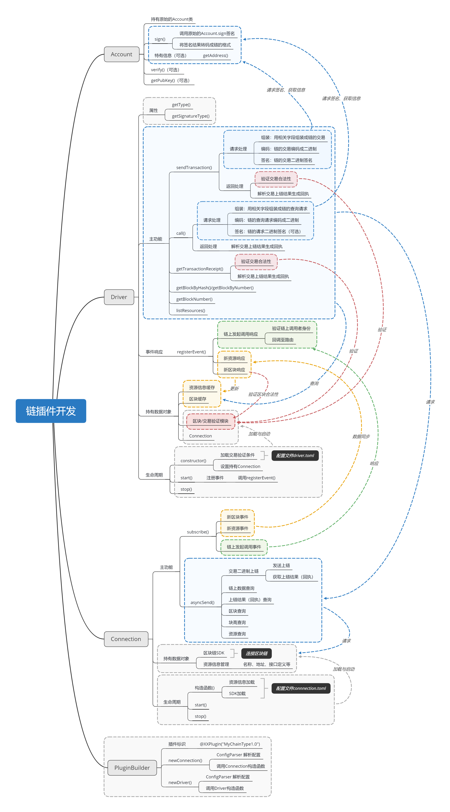

# 开发手册

目录

* [开发跨链应用](#开发跨链应用)
* [开发区块链插件](#开发区块链插件)

## 开发跨链应用

应用开发有两种技术方案供选择

* SDK发起（推荐）：面向协议编程，无需关心链类型，一次开发，多链适配。
* 区块链发起：传统的跨链调用方式，适合已有区块链应用的适配与接入。



**SDK 发起**

* [Luyu Java SDK](https://gitee.com/luyu-community/luyu-java-sdk)

**链上发起**

* [从 FISCO BCOS 发起](https://gitee.com/luyu-community/fisco-bcos-plugin/tree/feature-luyu/solidity)
* [从 Fabric 发起](https://gitee.com/luyu-community/fabric-plugin/tree/feature-luyu/sdk)
* （请直接访问链插件项目，查看具体用法）

## 开发区块链插件

区块链插件的开发是面向"统一接入协议"进行编程。在开始前，请阅读文档了解相关概念。

* 协议说明
* 白皮书




链插件中需开发的模块和逻辑关系描述如图所示，需按照相应区块链的逻辑做具体实现。




### 开发内容

完整的开发内容按照先后顺序如下

1. 插件初始化（灰色部分）：加载配置，初始化各种类。
2. 区块链调用（蓝色部分）：实现对区块链的调用与查询。此步骤完成时，插件已可用，已具备基础的功能。
3. 数据同步（黄色部分）：在上层请求与区块链间建立一层数据缓存，用于缓解上层频繁查询给区块链带来的压力。
4. 交易验证（红色部分）：按照链的实现定制上链交易的验证逻辑，此部分是跨链的基本安全需求。
5. 链上发起跨链调用的响应（绿色部分）：需设计链上合约的调用方式，并在插件中响应该链上事件。

### 模块描述

* [PluginBuilder](../src/main/java/link/luyu/protocol/link/PluginBuilder.java)：插件的初始化类，跨链路由根据此类定义的插件标识对该类进行实例化，并调用其中的new函数。
* [Connection](../src/main/java/link/luyu/protocol/link/Connection.java)：与区块链的连接类，用于管理与区块链的连接，响应Driver发来的请求，并将该请求上链。
* [Driver](../src/main/java/link/luyu/protocol/link/Driver.java)：链驱动，按照特定区块链的交易编码规则对交易进行编码，用Account类签名后生成交易二进制，发送给Connection上链。
* [Account](../src/main/java/link/luyu/protocol/network/Account.java)：集成账户服务的接口，并将账户服务的签名结果，公钥查询结果等转化为链自身的格式。

### 关键流程

图中已描述了完整的逻辑关系，此处给出关键流程。

**插件初始化阶段**

PluginBuilder 被跨链路由实例化

1. 调用newConnection()，传入connection.toml的配置
   * 链SDK加载，初始化与链的连接
   * 根据connection中的配置初始化资源列表，（若有）加载接口定义（ABI等）

2. 调用newDriver()，传入connection实例和driver.toml的配置信息
   * 加载交易验证逻辑的配置（若有）
   * 调用connection注册链事件
     * 注册区块事件，更新区块缓存
     * 注册资源变更事件，更新资源信息缓存（如ABI等）

**处理跨链交易阶段**

以处理一笔跨链交易为例

1. Driver收到跨链路由调用sendTransaction，拿到其参数 account，transaction，callback
2. Driver根据account构造自身的account实例
3. Driver根据transaction中的method，args和nonce等编码成待签名的交易二进制（编码时若涉及接口定义，可在资源缓存中获取）
4. Driver调用自身的account实例对代签名的交易二进制进行签名，生成可直接上链的交易二进制
5. Driver调用Connection，发送交易二进制
6. （如有，该插件所在路由不与目的链直接相连）Connection为RemoteConnection（路由中实现），收到后将二进制直接转发至目的区块链的Connection。
7. Connection收到交易二进制后，直接调用区块链的SDK将交易上链，并注册上链事件，等待交易上链回调。
8. 交易在区块链上上链，Connection的交易上链回调被调用，拿到交易回执等信息。
9. （与上一步同时）Connection的新区块回调被调用，将区块二进制同步至Driver，被Driver验证通过后处缓存下来。
10. Connection查询区块链，获取交易证明（SPV等信息），调用回调，将回执、交易证明返回给Driver。
11. Driver验证收到回执和交易证明，结合已缓存的区块二进制验证交易合法性。
12. Driver将回执解码，生成协议定义的回执格式，调用回调返回给Router。
13. 一笔跨链交易完成！

### 插件示例

链插件Demo：[Hello Plugin](https://gitee.com/luyu-community/hello-plugin) 

该插件内模拟了一条区块链，并实现了链插件的基础功能。处于可用状态。可参考该插件进行实现。

### 协议引用方式

插件中需引用协议，获取基础的接口定义。协议引用提供两种方式：

#### 1. maven（推荐）

以`gradle`为例（此处以`1.0.0`版本为例，推荐采用最新版本）

``` gradle
dependencies { implementation 'link.luyu:luyu-cross-chain-protocol:1.0.0'}
```

#### 2. 本地编译

在目录下

``` bash
bash gradlew assemble
```

生成的目录`dist/apps`下

``` 
luyu-protocol-xxxxxx.jar
```

将其拷贝至对应项目的classpath下，并引用此jar包即可，以`gradle`为例

``` gradle
dependencies { compile files('lib/luyu-cross-chain-protocol-xxxxxx.jar')}
```


